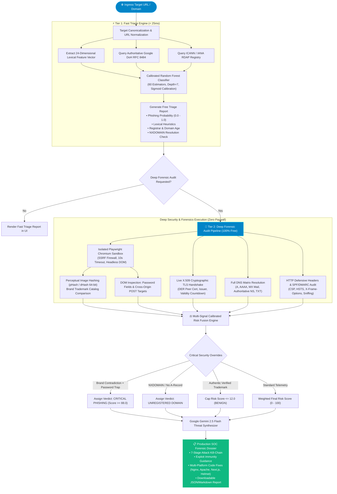
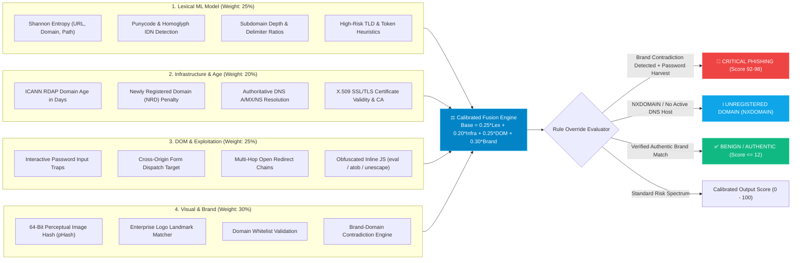
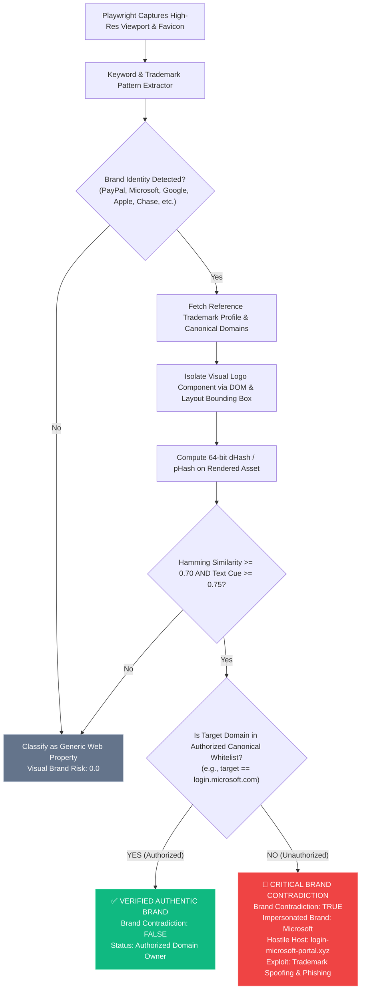
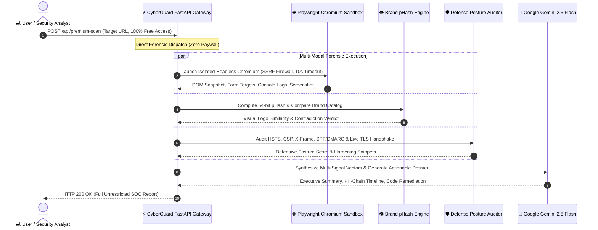
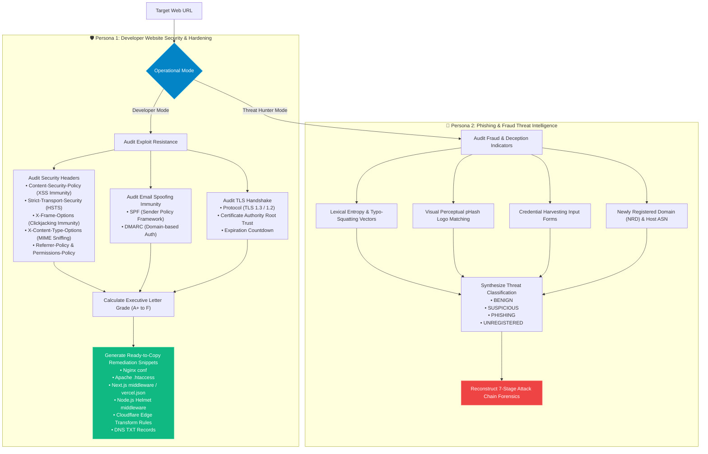

# 🛡️ CyberGuard AI (v2.0-SOC PRO)
> **Multi-Modal AI Phishing Intelligence, Exploit Immunity Auditor & Threat Telemetry Platform (100% Free & Open Access)**

<div align="center">

[](https://fastapi.tiangolo.com)
[](https://react.dev)
[](https://www.typescriptlang.org)
[](#)
[](https://ai.google.dev/)
[](https://playwright.dev)
[](https://scikit-learn.org)
[](https://developer.chrome.com/docs/extensions/)

</div>

---

## 📑 Table of Contents
1. [Executive Overview & Platform Vision](#-executive-overview--platform-vision)
2. [End-to-End System Architecture](#-end-to-end-system-architecture)
   - [Flowchart 1: Complete Threat Scanning & Inference Pipeline](#flowchart-1-complete-threat-scanning--inference-pipeline)
   - [Flowchart 2: Multi-Signal Bayesian Risk Fusion Matrix](#flowchart-2-multi-signal-bayesian-risk-fusion-matrix)
   - [Flowchart 3: Brand-Domain Contradiction & Logo Vision (pHash)](#flowchart-3-brand-domain-contradiction--logo-vision-phash)
   - [Flowchart 4: 7-Stage Adversary Kill-Chain Forensics](#flowchart-4-7-stage-adversary-kill-chain-forensics)
   - [Flowchart 5: Unrestricted Deep Forensic Execution](#flowchart-5-unrestricted-deep-forensic-execution)
   - [Flowchart 6: Dual-Persona Scanner Architecture](#flowchart-6-dual-persona-scanner-architecture)
3. [Deep Dive: Backend Inspection Pipeline & Engineering](#-deep-dive-backend-inspection-pipeline--engineering)
4. [Live Threat Intelligence Feeds & Datasets Used](#-live-threat-intelligence-feeds--datasets-used)
5. [Developer Website Hardening & Code Injection Immunity](#-developer-website-hardening--code-injection-immunity)
6. [CyberGuard AI Copilot: Interactive AppSec Assistant](#-cyberguard-ai-copilot-interactive-appsec-assistant)
7. [Complete Platform Feature Matrix](#-complete-platform-feature-matrix)
8. [Zero-Paywall Architecture & Open Access](#-zero-paywall-architecture--open-access)
9. [REST API Reference & Endpoints](#-rest-api-reference--endpoints)
10. [Local Deployment & Setup Guide](#-local-deployment--setup-guide)
11. [Manifest V3 Chrome Extension: Autonomous Background Shield](#-manifest-v3-chrome-extension-autonomous-background-shield)
12. [Technical FAQ & Security Architecture](#-technical-faq--security-architecture)

---

## 🌐 Executive Overview & Platform Vision

Modern cyber threats have evolved past the defensive perimeter of legacy reputation blacklists:
* **Ephemeral Attack Infrastructure**: Cyber adversaries utilize programmatic DNS provisioning, Cloudflare worker tunnels, and Newly Registered Domains (NRDs) that stay alive for **under 4 hours**—long before centralized blacklists index them.
* **Stealthy Brand Impersonation**: Phishing kits clone legitimate enterprise login interfaces (e.g. Microsoft 365, PayPal, Google Workspace) with pixel-level fidelity, evading simple string matching using dynamic character obviation and zero-width spaces.
* **Developer Security Gaps**: Web applications frequently launch missing critical HTTP security controls (`Content-Security-Policy`, `X-Frame-Options`, `HSTS`, `SPF/DMARC`), leaving applications vulnerable to Cross-Site Scripting (XSS), script injection, and Clickjacking.
* **Prohibitive SaaS Paywalls**: Security analysts, developers, and students face rigid subscription paywalls and credit card requirements for simple ad-hoc forensic lookups.

### The Solution
**CyberGuard AI** is a zero-trust, multi-modal threat intelligence engine and website vulnerability auditor. It operates on a **100% Real Live Telemetry** principle (zero synthetic or fabricated data) with **100% Free & Open Access**:
1. **Multi-Modal Threat Triage**: Sub-25ms 24-dimensional lexical machine learning fused with headless Chromium DOM telemetry, 64-bit perceptual visual hashing (`pHash`), and Google Gemini 2.5 Flash threat intelligence.
2. **Dual-Persona Scanning Mode**:
   - **Persona A (Developer & Webmaster)**: Audits HTTP defense headers, DNS mail authentication, and cryptographic TLS certificates, generating actionable, ready-to-deploy code fixes for Nginx, Apache, Next.js, Node.js Helmet, and Cloudflare.
   - **Persona B (End-User & Security Analyst)**: Unmasks phishing traps, credential harvesters, typo-squatted lookalikes, and brand contradictions.
3. **100% Free & Unrestricted Access**: All deep forensic audits, headless Chromium sandbox rendering, perceptual logo matching, and Gemini AI insights are completely unlocked for the global security community with zero fees, no wallet requirements, and no paywalls.
4. **Comprehensive SOC Suite**: Includes real-time Threat Intelligence dashboards, Email Link Extractor, Bulk URL Scanning, Password Strength & k-Anonymity Breach Verification, IP Carrier/ASN Intelligence, and Persistent Domain Watchlists.

---

## 📊 End-to-End System Architecture

### Flowchart 1: Complete Threat Scanning & Inference Pipeline



---

### Flowchart 2: Multi-Signal Bayesian Risk Fusion Matrix



---

### Flowchart 3: Brand-Domain Contradiction & Logo Vision (pHash)



---

### Flowchart 4: 7-Stage Adversary Kill-Chain Forensics

```mermaid
flowchart LR
    S1["1. Ingress Vector<br/>(Email / SMS / Ads)"] --> S2["2. Fast-Flux DNS<br/>(Dynamic Cloud Routing)"]
    S2 --> S3["3. TLS Encryption<br/>(Let's Encrypt / DV Cert)"]
    S3 --> S4["4. Redirect Cascade<br/>(Multi-Hop Cloaking)"]
    S4 --> S5["5. DOM Render<br/>(Brand Logo Emulation)"]
    S5 --> S6["6. Credential Trap<br/>(Fake Form POST)"]
    S6 --> S7["7. Exfiltration<br/>(Adversary C2 Server)"]

    style S1 fill:#3b82f6,stroke:#60a5fa,color:#fff
    style S2 fill:#6366f1,stroke:#818cf8,color:#fff
    style S3 fill:#8b5cf6,stroke:#a78bfa,color:#fff
    style S4 fill:#ec4899,stroke:#f472b6,color:#fff
    style S5 fill:#f59e0b,stroke:#fbbf24,color:#000
    style S6 fill:#f97316,stroke:#fb923c,color:#fff
    style S7 fill:#ef4444,stroke:#f87171,color:#fff
```



---

### Flowchart 5: Unrestricted Deep Forensic Execution



---

### Flowchart 6: Dual-Persona Scanner Architecture



---

## 🔬 Deep Dive: Backend Inspection Pipeline & Engineering

The CyberGuard AI backend is engineered in **FastAPI / Python 3.11+**, leveraging an asynchronous pipeline optimized for sub-second responses and memory-safe sandboxing.

### 1. Fast Triage Classifier (`backend/app/ml/classifier.py`)
* **Model**: Calibrated Random Forest Classifier (`n_estimators=60`, `max_depth=7`, with Sigmoid probability calibration).
* **Speed**: **< 25ms execution time**, requiring zero third-party API dependencies or external tokens.
* **Feature Extraction (24 Dimensions)**:
  1. `url_length`: Total character length of URL string.
  2. `domain_length`: Fully Qualified Domain Name (FQDN) length.
  3. `path_length`: Length of request URI path.
  4. `url_entropy`: Shannon entropy $H(X) = -\sum P(x) \log_2 P(x)$ across entire URL.
  5. `domain_entropy`: Shannon entropy of domain label (identifies algorithmic DGA domains).
  6. `path_entropy`: Shannon entropy of resource path.
  7. `subdomain_depth`: Count of sub-labels (e.g. `login.verify.update.example.com` = 4).
  8. `digit_ratio`: Proportion of numerical digits relative to alphabetics.
  9. `hyphen_count`: Frequency of hyphens in FQDN (common indicator of lookalike campaigns).
  10. `at_symbol_flag`: Detects embedded `@` credential obfuscation.
  11. `has_ip_address`: Detects raw IPv4/IPv6 literals instead of domain names.
  12. `punycode_flag`: Detects `xn--` Internationalized Domain Name (IDN) homoglyph attacks.
  13. `suspicious_tld`: Matches against high-abuse top-level domains (`.xyz`, `.top`, `.buzz`, `.club`, etc.).
  14. `brand_token_count`: Matches known enterprise brand keyword tokens within untrusted subdomains.
  15. `security_keywords`: Presence of deceptive trigger words (`login`, `secure`, `verify`, `billing`, `update`, `banking`).
  16. `query_param_count`: Number of GET parameters (identifies tracking & dynamic phishing payloads).
  17. `double_slash_redirect`: Detects protocol evasion sequences (`//` in path).
  18. `tld_in_subdomain`: Detects deceptive nested TLD tokens (e.g. `paypal.com.account-update.xyz`).
  19. `consecutive_consonants`: Identifies machine-generated domain names.
  20. `vowel_ratio`: Statistical balance of vowel distribution.
  21. `domain_age_penalty`: Inversely proportional age score based on RDAP registration date.
  22. `tld_risk_weight`: Normalized registry abuse index.
  23. `port_flag`: Non-standard port declarations (`:8080`, `:8443`).
  24. `path_depth`: Count of directory delimiters.

### 2. Isolated Chromium Sandboxing (`backend/app/collectors/crawler.py`)
* Deep audits launch a headless **Playwright Chromium** browser instance inside an isolated asynchronous context.
* **Hardened Security Perimeter**:
  - Strict 10-second request timeout.
  - Server-Side Request Forgery (SSRF) guard preventing navigation to RFC 1918 private subnets (`127.0.0.1`, `10.0.0.0/8`, `192.168.0.0/16`, `169.254.169.254` AWS metadata).
  - Web popups, automated file downloads, and notification permissions disabled.
  - User-Agent rotators reflecting genuine modern desktop browsers.
* **Telemetric Extraction**:
  - Live high-resolution viewport capture (1280x800).
  - DOM tree parsing: identifying `<input type="password">`, hidden input fields, and `<form action="...">` targets.
  - Detection of cross-origin dispatch (e.g. page hosted on `domain-a.com` submitting credentials to `exfil-b.ru`).
  - Analysis of obfuscated client-side JavaScript (`eval()`, `atob()`, `String.fromCharCode()`, `unescape()`).

### 3. Visual Perception & Brand Contradiction Engine (`backend/app/ml/brand_vision.py`)
* Phishing campaigns clone official logos while hosting on deceptive domains.
* **Perceptual Difference Hashing (`dHash` / `pHash`)**:
  - Rendered DOM logos are cropped, converted to grayscale, and downsampled to an $8 \times 8$ gradient matrix.
  - Produces a 64-bit fingerprint invariant to minor scaling, JPEG compression artifacts, and color shifts.
  - Calculates Hamming distance $D_H$ against an authentic enterprise trademark catalogue (PayPal, Microsoft, Google, Apple, Amazon, Chase, Bank of America, Facebook, Netflix).
* **Contradiction Evaluation**:
  - If visual similarity $S \ge 0.70$ and brand text cues $T \ge 0.75$, the target domain is checked against the brand's verified canonical domain whitelist.
  - If the domain does **not** match the authorized ownership whitelist, a **Critical Brand Contradiction** is flagged, overriding the risk score directly to the `CRITICAL PHISHING` tier.

### 4. Cryptographic TLS/SSL & Network Hierarchy (`backend/app/collectors/domain_intel.py`)
* **Real X.509 DER Certificate Extraction**:
  - Connects directly to target port 443 via Python `ssl` and `socket`.
  - Extracts the binary DER peer certificate and parses it using `cryptography.x509`.
  - Audits Subject, Common Name (CN), Subject Alternative Names (SANs), Verified Issuer Organization, Public CA root trust chain, expiration timestamp, and self-signed certificate flags.
* **DNS Resolution Matrix**:
  - Direct queries via **Google DNS-over-HTTPS (DoH RFC 8484)** for `A`, `AAAA`, `MX`, `NS`, and `TXT` records.
  - Audits mail routing infrastructure and authoritative nameserver redundancy.
* **Unregistered Domain (NXDOMAIN) Handling**:
  - If DNS resolution returns `Status: 3 (NXDOMAIN)` or ICANN RDAP returns `HTTP 404`:
  - CyberGuard AI strictly outputs `UNREGISTERED`, suppressing fake data, synthetic IP addresses, or placeholder SSL certificates.
  - UI displays an `UNREGISTERED DOMAIN (NXDOMAIN)` notice informing the operator that no active server or network route exists.

### 5. Google Gemini 2.5 Flash Threat Intelligence (`backend/app/ml/ai_explainer.py`)
* The multi-signal telemetry payload is formatted into a structured schema and dispatched to **Google Gemini 2.5 Flash** (`gemini-2.5-flash`).
* The LLM synthesizes the technical data into:
  - An executive threat summary in plain English.
  - Explanations of how attackers weaponized the target domain.
  - Concrete mitigation steps for affected administrators and deceptive indicators for end users.

---

## 📡 Live Threat Intelligence Feeds & Datasets Used

CyberGuard AI strictly enforces a **Zero Synthetic Data Policy**. All outputs are derived from real, live, authoritative protocols and APIs:

| Intelligence Source | Type / Protocol | Endpoint / Provider | Purpose in CyberGuard AI |
| :--- | :--- | :--- | :--- |
| **Google Public DoH** | DNS-over-HTTPS (RFC 8484) | `https://dns.google/resolve` | Authoritative DNS resolution for A, AAAA, MX, NS, and TXT records. Instant NXDOMAIN detection. |
| **ICANN / IANA RDAP** | RESTful RDAP | `https://rdap.org/domain/` | Authoritative domain registration age, expiration date, and sponsoring registrar entity identification. |
| **HaveIBeenPwned API** | REST k-Anonymity | `https://api.pwnedpasswords.com/range/` | Cryptographic SHA-1 prefix credential breach auditing. Validates if user passwords have leaked. |
| **IP-API Geolocation** | BGP / ASN Intelligence | `http://ip-api.com/json/` | Autonomous System Number (ASN), ISP carrier, hosting/datacenter classification, and server location. |
| **Port 43 Socket WHOIS** | TCP RFC 3912 | Direct registry socket | Fallback WHOIS resolution when RDAP endpoints are throttled or unallocated. |
| **Python Cryptography** | X.509 DER Parsing | Port 443 SSL handshake | Cryptographic validation of TLS peer certificates, Subject Alternative Names, and issuer authority. |

---

## 🛡️ Developer Website Hardening & Code Injection Immunity

CyberGuard AI provides a dedicated **Developer Website Security Audit** designed to harden web applications against code injection, Cross-Site Scripting (XSS), Clickjacking, and protocol downgrade exploits:

```
+-------------------------------------------------------------------------------------------------------------+
|                                    DEFENSIVE SECURITY CONTROLS AUDITED                                      |
+--------------------------+------------------------------+---------------------------------------------------+
| Defensive Control        | Threat Vector Blocked        | Recommended Directive Implementation              |
+--------------------------+------------------------------+---------------------------------------------------+
| Content-Security-Policy  | Cross-Site Scripting (XSS),  | default-src 'self'; script-src 'self' 'nonce-...';|
| (CSP)                    | Malicious Script Injection,  | object-src 'none'; base-uri 'self';               |
|                          | Data Exfiltration            | frame-ancestors 'none';                           |
+--------------------------+------------------------------+---------------------------------------------------+
| Strict-Transport-Security| SSL Stripping, Man-in-the-   | max-age=63072000; includeSubDomains; preload      |
| (HSTS)                   | Middle (MitM) Attacks        |                                                   |
+--------------------------+------------------------------+---------------------------------------------------+
| X-Frame-Options          | Clickjacking, Hidden UI      | DENY (or SAMEORIGIN)                              |
|                          | Redressing Exploits          |                                                   |
+--------------------------+------------------------------+---------------------------------------------------+
| X-Content-Type-Options   | MIME-Confusion Exploits,     | nosniff                                           |
|                          | Drive-By Downloads           |                                                   |
+--------------------------+------------------------------+---------------------------------------------------+
| Referrer-Policy          | Information Leakage via URLs | strict-origin-when-cross-origin                   |
+--------------------------+------------------------------+---------------------------------------------------+
| Permissions-Policy       | Hardware Hijacking (Camera,  | camera=(), microphone=(), geolocation=(), usb=()  |
|                          | Microphone, Geolocation)     |                                                   |
+--------------------------+------------------------------+---------------------------------------------------+
| SPF (DNS TXT)            | Email Spoofing & Phishing    | v=spf1 mx include:_spf.google.com ~all            |
|                          | Sent From Your Domain        |                                                   |
+--------------------------+------------------------------+---------------------------------------------------+
| DMARC (DNS TXT)          | Unauthorized Domain Mail     | v=DMARC1; p=reject; rua=mailto:dmarc@example.com  |
|                          | Delivery & Domain Impersonation                                                 |
+--------------------------+------------------------------+---------------------------------------------------+
```

### 1-Click Multi-Platform Remediation Generators
For any missing or weak security controls, CyberGuard AI automatically formats ready-to-paste configurations tailored for:
* **Nginx** (`/etc/nginx/conf.d/security_headers.conf`)
* **Apache HTTP Server** (`.htaccess` / `httpd.conf`)
* **Next.js & Vercel** (`middleware.ts` / `vercel.json`)
* **Node.js Express** (`helmet` configuration snippet)
* **Cloudflare** (Edge Transform Rules expression)
* **DNS Providers** (Authoritative TXT records for SPF and DMARC)

---

## 🤖 CyberGuard AI Copilot: Interactive AppSec Assistant

The platform embeds **CyberGuard AI Copilot**, an autonomous defensive cybersecurity and Application Security (AppSec) agent connected directly to live forensic scan telemetry:

```
                  +----------------------------------------------+
                  |         CYBERGUARD AI COPILOT ENGINE         |
                  +----------------------------------------------+
                                         |
     +-------------------+---------------+-------------------+-------------------+
     |                   |                                   |                   |
     v                   v                                   v                   v
+------------+  +-------------------+               +-------------------+  +---------------+
| VULNERABILITY |  | DIRECT DOMAIN Q&A |               | REMEDIATION GUIDE |  | SCAM SENTINEL |
|   AUDIT    |  | (Age, DNS, SSL)   |               | (Nginx, Node, SQL)|  | (Job Scams)   |
+------------+  +-------------------+               +-------------------+  +---------------+
     |                   |                                   |                   |
     +-------------------+---------------+-------------------+-------------------+
                                         |
                                         v
                  +----------------------------------------------+
                  |  Interactive Animated Chat UI (Cyberpunk)   |
                  +----------------------------------------------+
```

### Key Copilot Capabilities:

1. **Direct Natural Language Domain Intelligence**:
   - **Registration & Domain Age**: Ask *"when it registered"*, *"when was it created"*, *"domain age"*, or *"who is the registrar"*. The Copilot retrieves exact RDAP creation dates, domain age in days, accredited registrars, and calculates Newly Registered Domain (NRD) threat status (<30 day correlation with disposable phishing kits).
   - **DNS Infrastructure & Routing**: Ask *"what is the ip"*, *"where is it hosted"*, or *"what are the nameservers"*. Retrieves authoritative A-record IPv4/IPv6 addresses, hosting providers, and authoritative NS records.
   - **SSL/TLS Encryption & Ciphers**: Ask *"is ssl valid"*, *"who issued the certificate"*, or *"is the connection encrypted"*. Checks TLS validity, certificate authority (Let's Encrypt, DigiCert, Sectigo), and MitM downgrade risk.
   - **Security Grade & Defensive Headers**: Ask *"what headers are missing"* or *"why did it receive Grade B"*. Breaches down missing controls (`CSP`, `HSTS`, `X-Frame-Options`, `nosniff`, `Referrer-Policy`) and their exploit potential.
   - **Executive Dossiers**: Ask *"tell me about [domain]"* or *"summarize this site"* for a complete executive risk brief.

2. **Developer Hackability & Vulnerability Auditing**:
   - When developers ask *"Is my website safe?"* or *"Is it easily hackable?"*, the Copilot acts as a senior penetration tester:
     - **Cross-Site Scripting (XSS)**: Analyzes absence of `Content-Security-Policy` and potential session token exfiltration.
     - **Clickjacking & UI Redressing**: Explains `<iframe>` overlay attacks when `X-Frame-Options` or `frame-ancestors` are missing.
     - **SSL Stripping & MitM**: Audits `Strict-Transport-Security` (HSTS) preload flags against untrusted Wi-Fi adversaries.
     - **MIME Sniffing**: Inspects `X-Content-Type-Options: nosniff` against user-uploaded script execution.
     - **Email Domain Spoofing**: Checks `DMARC` (`p=reject`) and `SPF` to stop CEO fraud and forged emails.

3. **Step-by-Step Developer Remediation Blueprints**:
   - Provides ready-to-deploy code configurations:
     - **Nginx Reverse Proxy**: Production `/etc/nginx/conf.d/security.conf` with 7 essential defensive headers.
     - **Node.js / Express**: Automated header hardening via `helmet()` and IP-based rate limiting via `express-rate-limit`.
     - **Next.js**: Security header definitions for `next.config.js` or `middleware.ts`.
     - **SQL Injection Immunization**: Parameterized query examples across Python DB-API, Prisma, and SQLAlchemy.
     - **Cookie Hardening**: Proper deployment of `HttpOnly; Secure; SameSite=Strict; Path=/`.

4. **Zero-Phantom Pre-Scan Guard**:
   - The Copilot enforces a strict verification model: if no website URL has been scanned, it refuses to invent phantom reports or use placeholder domains (e.g. `"target website"`).
   - Prompts the user to enter their URL in the Scanner tab or provides general production hardening templates clearly labeled as generic server configurations.

5. **Employment & Internship Scam Sentinel**:
   - Protects users against job scams by detecting upfront fee demands, freemail HR accounts (`@gmail.com`), fake cashier check equipment laundering, and informal chat-only interviews.

---

## 🎛️ Complete Platform Feature Matrix

```
+----------------------------------------------------------------------------------------------------+
|                                    CYBERGUARD AI FEATURE MATRIX                                    |
+------------------------------------------------------------------+----------------+----------------+
| Capability / Inspection Layer                                    | Free Tier (L1) | Deep Audit (L2)|
+------------------------------------------------------------------+----------------+----------------+
| 24-Dimensional URL Lexical Random Forest Classifier              |       ✅       |       ✅       |
| Calibrated Phishing Probability Score (0 - 100)                  |       ✅       |       ✅       |
| Authoritative Google DoH DNS Resolution (A, AAAA, MX, NS, TXT)   |       ✅       |       ✅       |
| Authoritative ICANN RDAP Domain Age & Registrar Resolution       |       ✅       |       ✅       |
| Unregistered Domain (NXDOMAIN) Verification                      |       ✅       |       ✅       |
| Multi-Signal Calibrated Risk Fusion                              |       ✅       |       ✅       |
| Threat Intelligence Center (Live SOC Metrics & Risky TLDs)       |       ✅       |       ✅       |
| Bulk URL Scanner (Concurrent Batch Processing + CSV Export)      |       ✅       |       ✅       |
| Email Link Extractor & Phishing Triage                           |       ✅       |       ✅       |
| Password Strength & HIBP k-Anonymity Breach Verification         |       ✅       |       ✅       |
| IP Reputation & Geolocation (ASN, Reverse DNS, Abuse Index)      |       ✅       |       ✅       |
| Domain Watchlist & Live Alerts (Persistent Surveillance)         |       ✅       |       ✅       |
| Scan History & Side-by-Side Comparison Drawer                    |       ✅       |       ✅       |
| Interactive Cyber Defense AI Chatbot Assistant                   |       ✅       |       ✅       |
| Manifest V3 Chrome Extension Active Tab Protection               |       ✅       |       ✅       |
| Headless Playwright Chromium Sandbox Capture & Viewport          |       ✅       |       ✅       |
| Computer Vision Brand-Domain Contradiction Engine (pHash)        |       ✅       |       ✅       |
| Live X.509 DER TLS/SSL Peer Certificate Extraction               |       ✅       |       ✅       |
| Website Security Posture Audit (CSP, HSTS, X-Frame-Options)      |       ✅       |       ✅       |
| 1-Click Remediation Snippets (Nginx, Apache, Next.js, Cloudflare)|       ✅       |       ✅       |
| Complete 7-Stage Adversary Kill-Chain Timeline                   |       ✅       |       ✅       |
| Google Gemini 2.5 Flash Threat Intelligence Dossier              |       ✅       |       ✅       |
| Access Model & Cost                                              |  100% Free / $0|  100% Free / $0|
+------------------------------------------------------------------+----------------+----------------+
```

---

## 🔓 Zero-Paywall Architecture & Open Access

### 100% Free & Open-Access Cybersecurity
CyberGuard AI operates as an open-source, community-accessible cybersecurity intelligence platform. All features that traditionally sit behind expensive SaaS paywalls or API credits are provided **100% free with zero fees**:

* **Unrestricted Deep Forensic Audits**: Launch headless Chromium sandbox DOM analyses, inspect form targets, and extract raw screenshots on demand.
* **Computer Vision Brand Contradiction Engine**: Compute 64-bit perceptual image hashes (pHash/dHash) against our verified enterprise brand catalog with zero restrictions.
* **Google Gemini 2.5 Flash Threat Intelligence**: Automatically synthesize multi-vector findings into actionable kill-chain timelines and code remediation snippets without requiring personal API keys.
* **Real-Time SOC Tools**: Free access to bulk domain triage, email phishing link extraction, HaveIBeenPwned k-anonymity password breach checking, IP BGP/carrier intelligence, and live threat telemetry.

---

## 🔌 REST API Reference & Endpoints

| Method | Endpoint | Description | Auth / Tier |
| :--- | :--- | :--- | :--- |
| `POST` | `/api/scan/free` | Performs fast lexical ML triage, DoH DNS lookups, and RDAP age checks | 100% Free |
| `POST` | `/api/premium-scan` | Executes deep Playwright sandbox, pHash logo matching, TLS DER cert, and Gemini AI | 100% Free |
| `POST` | `/api/scan/bulk` | Parallel batch scanning of up to 20 domains with forensic aggregations | 100% Free |
| `GET` | `/api/threat/stats` | Returns real-time SOC metrics, top impersonated brands, and risky TLD telemetry | 100% Free |
| `POST` | `/api/tools/password-strength`| Evaluates password entropy, crack time, and checks HIBP k-anonymity breach database | 100% Free |
| `POST` | `/api/tools/ip-reputation` | Resolves IP geolocation, carrier ASN, abuse risk index, and reverse DNS (PTR) | 100% Free |
| `GET` | `/api/watchlist` | Retrieves all domains currently monitored in the watchlist | 100% Free |
| `POST` | `/api/watchlist` | Adds a domain and metadata tags to the surveillance watchlist | 100% Free |
| `DELETE`| `/api/watchlist/{id}` | Removes a monitored domain from the surveillance watchlist | 100% Free |
| `POST` | `/api/chat` | Contextual AI cybersecurity assistant answering questions about scan results | 100% Free |
| `GET` | `/api/extension/download` | Direct zip package download of the CyberGuard AI Chrome Extension | 100% Free |

---

## 💻 Local Deployment & Setup Guide

### 1. System Prerequisites
* **Python 3.10+** (Tested on 3.11 and 3.12)
* **Node.js 18+** & **npm 9+**
* **Google Chrome / Chromium** (required for Playwright)

### 2. Repository Setup
```bash
git clone https://github.com/Siddhartha39/Cyberguard-AI.git
cd Cyberguard-AI
```

### 3. Backend Setup
```bash
# Navigate to backend directory and install Python dependencies
cd backend
pip install -r requirements.txt

# Install Playwright Chromium browser binaries
playwright install chromium

# Launch the FastAPI server with hot-reload
cd ..
PYTHONPATH=backend python3 -m uvicorn app.main:app --host 0.0.0.0 --port 8000 --reload
```
* **API Server Running**: `http://localhost:8000`
* **Interactive OpenAPI (Swagger) Docs**: `http://localhost:8000/docs`

### 4. Frontend Setup
```bash
# Navigate to frontend directory and install npm packages
cd frontend
npm install

# Start the Vite development server
npm run dev -- --host 0.0.0.0 --port 5173
```
* **SOC Web Console**: `http://localhost:5173`

---

## 🧩 Manifest V3 Chrome Extension: Autonomous Background Shield

The platform includes a production **Manifest V3 Chrome Extension** (`v2.1.0`) located in the `extension/` directory, engineered for continuous, real-time browsing protection:

```
+-----------------------------------------------------------------------------------+
|               CYBERGUARD AI BROWSER DEFENSE LIFECYCLE (MANIFEST V3)               |
+-----------------------------------------------------------------------------------+
 1. User Navigates to Website (chrome.tabs.onUpdated)
    │
    ▼
 2. Background Service Worker (background.js) Intercepts Navigation
    ├─ Sets Badge to "..." (Blue)
    ├─ Queries Local Backend (:8000) or Autonomous Edge DoH Engine
    ├─ Computes Threat Score, Security Grade, DNS/TLS Telemetry
    └─ Caches Scan Result in chrome.storage.local (15-min TTL)
    │
    ▼
 3. Threat Assessment & Badge Update
    ├─ BENIGN       ──> Badge "SAFE" (Green)
    ├─ SUSPICIOUS   ──> Badge "WARN" (Orange)
    └─ PHISHING     ──> Badge "ALERT" (Red) + Native Desktop Warning Notification!
    │
    ▼
 4. User Opens Extension Popup (popup.js)
    └─ Instant Zero-Wait Render (0ms): Threat Index, Security Grade, Telemetry & Brief!
+-----------------------------------------------------------------------------------+
```

### Core Extension Features:
1. **Automatic Background Scanning on Page Visit**:
   - The extension service worker (`background.js`) runs continuously and audits websites the moment you visit them—**no manual clicking required**.
2. **Real-Time Browser Toolbar Badges**:
   - Visual status indicators (`SAFE`, `WARN`, `ALERT`) reflect the live threat level of the active tab.
   - Automatically switches badges when toggling between browser tabs (`chrome.tabs.onActivated`).
3. **Native Phishing Threat Desktop Alerts**:
   - If a deceptive lookalike or credential harvesting portal is detected, Chrome automatically fires an OS-level notification warning you before you submit passwords.
4. **Instant Zero-Wait Popup UI**:
   - Retrieves pre-audited telemetry from local extension storage. When you click the shield icon, results appear **instantly** without waiting for network latency or showing loading placeholders.
   - Includes a **🔄 Force Re-scan** button for manual audits on demand.
5. **Autonomous Edge DNS Shield (Zero-Backend Mode)**:
   - If your local Python backend is offline, the extension seamlessly switches to client-side Google DoH resolution and lexical entropy calculation, operating completely independently on any device.

### How to Install in Google Chrome, Brave, or Edge:
1. Open your browser and navigate to `chrome://extensions/`.
2. Enable **Developer mode** using the toggle in the top-right corner.
3. Click **Load unpacked** in the top-left corner.
4. Select the `extension/` folder inside the project root (`/Users/siddhartha/Desktop/aad/projects/cyberAI/extension`).
5. Pin the **CyberGuard AI** shield icon to your browser toolbar!
6. Alternatively, download the ready-to-use zip package directly from the **Extension** tab in the web application (`CyberGuard-AI-Chrome-Extension.zip`).

---

## ❓ Technical FAQ & Security Architecture

<details>
<summary><strong>1. Why use a Calibrated Random Forest for Fast Triage instead of calling an LLM directly?</strong></summary>

> **Answer**: Latency, cost, and reliability. The Fast Triage classifier extracts a 24-dimensional handcrafted lexical feature vector and evaluates it in **< 25ms** entirely in local CPU memory without consuming API tokens or incurring network round-trips. This delivers an instant initial triage score, seamlessly triggering the heavier headless Chromium sandbox and Google Gemini 2.5 Flash synthesis for comprehensive forensic dossiers.
</details>

<details>
<summary><strong>2. How does CyberGuard AI avoid False Positives on newly launched legitimate startups?</strong></summary>

> **Answer**: Domain age is only weighted at 20% in the Bayesian risk fusion matrix. A newly registered domain that does *not* impersonate an established trademark, does *not* present credential harvesting inputs, and does *not* utilize high-entropy URL obfuscation receives a safe score (~12-15/100). The Brand-Domain Contradiction Engine specifically verifies whether a site is genuinely claiming to be an enterprise brand or simply operating as an independent business.
</details>

<details>
<summary><strong>3. Is CyberGuard AI completely free to use?</strong></summary>

> **Answer**: Yes. CyberGuard AI is 100% free, open-access, and community-driven. All capabilities—including headless Chromium DOM telemetry, 64-bit logo pHash brand matching, security headers/clickjacking auditing, and Google Gemini AI threat intelligence—operate with zero fees and no paywalls.
</details>

<details>
<summary><strong>4. How are unregistered or non-existent domains handled?</strong></summary>

> **Answer**: Queries are dispatched to authoritative Google DNS-over-HTTPS (`Status: 3 NXDOMAIN`) and ICANN RDAP (`HTTP 404`). If a domain is unallocated, CyberGuard AI immediately assigns the verdict `UNREGISTERED` and displays an explicit `NXDOMAIN (No Host IP Assigned)` status in the UI, suppressing fake SSL certificates, synthetic IP addresses, or simulated headers.
</details>

<details>
<summary><strong>5. What security controls protect the Playwright crawler from malicious targets?</strong></summary>

> **Answer**: The Playwright sandbox operates in a strictly isolated headless Chromium process with an SSRF firewall preventing connections to internal or private subnets (RFC 1918), resource-blocking rules for untrusted scripts, disabled popup windows, and a strict 10-second timeout.
</details>

<details>
<summary><strong>6. How is user privacy preserved in the Password Checker?</strong></summary>

> **Answer**: The Password Checker utilizes the **k-anonymity mathematical model**. The client SHA-1 hashes the password locally, and only the **first 5 characters** of the 40-character hex hash are dispatched to the HaveIBeenPwned API (`/range/{prefix}`). The API returns approximately 500-1000 matching hash suffixes without ever knowing the user's full hash or actual password. The client searches the returned suffixes locally in browser memory.
</details>

---

## 📄 License
This project is licensed under the **MIT License**. Built for advanced cybersecurity intelligence, zero-trust vulnerability auditing, and decentralized Web3 micropayments.
